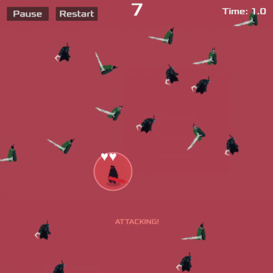

# fantastic-octo-barnacle

This repository contains code written during following a tutorial "Your first 2D game". The name of the repo was randomly generated by GitHub.

Tutorial: https://docs.godotengine.org/en/stable/getting_started/first_2d_game/index.html

The core mechanic of the game in the tutorial is that a player needs to "dodge creeps" for as long as possible. To make it a challenge, the author of this repo decided to change the mission to eat as many enemies as possible. The game has since evolved to include combat mechanics, scoring, leaderboards, and more.

# Game Preview

# How to run

If you decide to run the project, you have two options.

**Via Godot Engine**:
1. Install Godot Engine (latest stable version recommended).
2. Clone this repository to your local machine.
3. Open Godot Engine and select "Import" to open the cloned project folder.
4. Press F6 to run the game.

**Via executable**:
- Download the executable file for your operating system from the "Releases" section of this repository: https://github.com/caffeinated-ops/fantastic-octo-barnacle/releases/tag/v0.1.1
    - For Windows, download `DevourAll.exe`.
    - For Linux, download `DevourAll.x86_64`.
- Extract the downloaded file to a desired location.
- Run the executable file:
    - On Windows, double-click `DevourAll.exe`.
    - On Linux, run `./DevourAll.x86_64` from the terminal. If needed, make the file executable with `chmod +x DevourAll.x86_64`.

# How to Play

- Use arrow keys or WASD to move the player character.
- Eat as many enemies as possible to increase your score.
- Engage in combat: deal and take damage from enemies.
- Survive as long as possible while the timer runs.
- View your final score and check the leaderboards.
- Use pause and restart buttons to control gameplay.

# Technologies and Resources Used

- [Godot Engine](https://godotengine.org/) - Open-source game engine used for developing the game.
- GDScript - Scripting language used in Godot for game logic.  
- [Burrito](https://immortal-burrito.itch.io/) - Digital artist who created the game assets used in this project (with permission).

# License

This project is licensed under the MIT License - see the [LICENSE](LICENSE) file for details.

# Minimum System Requirements

- Godot Engine 4.5+ installed (if running via editor)
- Operating System: Windows 7/8/10 or Linux

# Future Improvements

- Add sound effects and background music.
- Improve user interface and visual effects.
- Implement different attack types or power-ups for the player.
- Add statistics tracking (e.g., highest score, total enemies eaten).

See [CHANGELOG.md](CHANGELOG.md) for detailed version history.